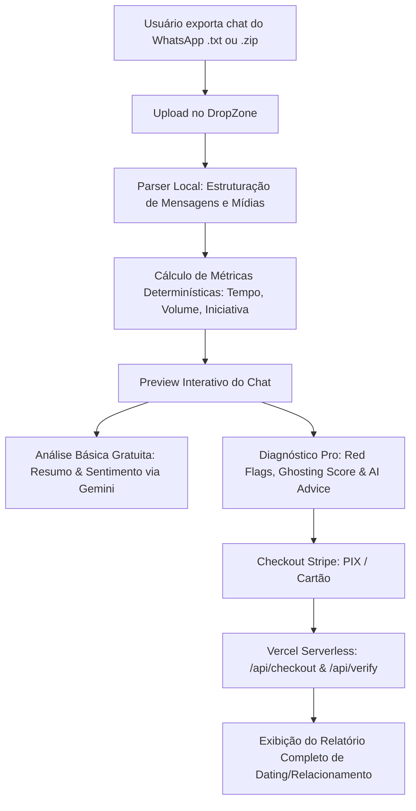

<div align="center">

# 💬 VibeCheck AI

**A inteligência artificial que decifra o interesse, reciprocidade e a saúde das suas conversas no WhatsApp.**

<br />


<br />

[](https://react.dev/)
[](https://www.typescriptlang.org/)
[](https://vitejs.dev/)
[](https://ai.google.dev/)
[](https://stripe.com/)
[](https://vercel.com/)
[](https://vitest.dev/)

</div>

---

## 📖 Visão Geral

O **VibeCheck AI** é uma plataforma moderna construída para transformar conversas exportadas do WhatsApp em diagnósticos comportamentais e psicológicos precisos. Combinando **métricas estatísticas determinísticas** e **inteligência artificial generativa de ponta (Google Gemini)**, a ferramenta revela dinâmicas de interesse, índices de reciprocidade e padrões ocultos de comunicação.

---

## ✨ Principais Funcionalidades

### 📥 1. Ingestão e Parser Inteligente
- Suporte a arquivos `.txt` (exportação padrão do WhatsApp) e `.zip` (exportações completas contendo fotos, áudios e mídias).
- Normalização automática de datas e formatos de mensagens nos padrões iOS e Android em múltiplos idiomas (Português, Inglês, Espanhol).
- Pré-visualização nativa e interativa no formato de chat estilo WhatsApp.

### 📊 2. Métricas Comportamentais Determinísticas
- **Equilíbrio de Conversa:** Percentual e contagem de mensagens enviadas por cada participante.
- **Tempo Médio de Resposta:** Identificação de quem demora mais para responder.
- **Iniciativa de Conversas:** Contagem de quem puxa mais assunto após pausas prolongadas.
- **Horários de Pico:** Mapeamento dos períodos do dia com maior engajamento.

### 🧠 3. Diagnóstico Psicológico & Relatório Pro (Google Gemini)
- **Ghosting Score:** Pontuação individual de 0 a 100 baseada em evidências factuais.
- **Red Flags & Green Flags:** Identificação de alertas e pontos positivos acompanhados pelas **citações textuais exatas** da conversa.
- **Relationship Health:** Índice global de saúde e reciprocidade da relação.
- **AI Advice:** Conselho direto e personalizado formulado com base na dinâmica observada.

### 💳 4. Monetização Integrada (Stripe + Vercel Functions)
- Checkout transparente com suporte a **PIX** e **Cartão de Crédito**.
- Validação serverless segura via endpoints `/api/checkout` e `/api/verify`.
- Liberação instantânea do relatório completo após confirmação do pagamento.

### 🔒 5. Privacidade e Segurança por Design
- O processamento de métricas e parsing ocorre no navegador do usuário.
- Apenas recortes amostrais anonimizados e dados consolidados são trafegados para a IA, garantindo privacidade aos dados pessoais.

---

## 🏗️ Arquitetura e Fluxo de Dados



---

## 🛠️ Tecnologias Utilizadas

| Camada | Tecnologia | Finalidade |
| :--- | :--- | :--- |
| **Frontend** | React 19, TypeScript, Vite 6 | Interface interativa, responsiva e performática |
| **Estilização & Ícones** | Tailwind CSS, Lucide React | Design moderno com estética dark mode |
| **Parsing & Arquivos** | JSZip | Descompactação e leitura de mídias/mensagens |
| **Inteligência Artificial** | `@google/genai` (Gemini Flash) | Análise psicológica, detecção de padrões e síntese |
| **Pagamentos & Backend** | Stripe Node SDK, Vercel Serverless | Sessões de pagamento e verificação de status |
| **Testes** | Vitest | Testes unitários do motor de métricas e parser |

---

## 🚀 Como Executar Localmente

### Pré-requisitos
- **Node.js** (versão 18 ou superior)
- Gerenciador de pacotes **npm**, **yarn** ou **pnpm**
- Chave de API do **Google Gemini** ([Google AI Studio](https://aistudio.google.com/))

### 1. Clonar o Repositório
```bash
git clone https://github.com/<SEU-USUARIO>/vibecheck-ai.git
cd vibecheck-ai
```

### 2. Instalar as Dependências
```bash
npm install
```

### 3. Configurar as Variáveis de Ambiente
Crie um arquivo `.env` a partir do modelo disponibilizado:
```bash
cp .env.example .env
```
Edite o arquivo `.env` e insira suas chaves:
```env
GEMINI_API_KEY=sua_chave_gemini_aqui
STRIPE_SECRET_KEY=sk_test_sua_chave_stripe_aqui
```

### 4. Iniciar o Servidor de Desenvolvimento
```bash
npm run dev
```
Acesse a aplicação em [http://localhost:3001](http://localhost:3001).

### 5. Executar os Testes Automatizados
```bash
npm test
```

---

## 🌐 Deploy na Vercel

O projeto está pronto para implantação com 1 clique na **Vercel**:

1. Crie um novo projeto na [Vercel](https://vercel.com/) e importe este repositório do GitHub.
2. Em **Settings > Environment Variables**, adicione as seguintes variáveis:
   - `GEMINI_API_KEY`: Sua chave do Google Gemini.
   - `STRIPE_SECRET_KEY`: Sua chave secreta do Stripe (modo Live ou Test).
3. O build command padrão (`npm run build`) e output directory (`dist`) serão identificados automaticamente.
4. Clique em **Deploy**. As rotas de API em `/api/*.ts` funcionarão como funções Serverless nativas.

---

## 📁 Estrutura de Diretórios

```
vibecheck-ai/
├── api/                  # Funções Serverless da Vercel (Checkout e Verificação Stripe)
│   ├── checkout.ts
│   └── verify.ts
├── components/           # Componentes visuais do React
│   ├── ChatBubble.tsx    # Bolhas de mensagem com suporte a mídias
│   └── DropZone.tsx      # Área de arrastar e soltar arquivos (.txt / .zip)
├── services/             # Integração com APIs externas
│   └── geminiService.ts  # Chamadas estruturadas à API do Google Gemini
├── utils/                # Utilitários e algoritmos de cálculo
│   ├── metrics.ts        # Algoritmos determinísticos de métricas e ghosting
│   └── parser.ts         # Parser de logs de conversa do WhatsApp
├── tests/                # Suíte de testes automatizados com Vitest
│   ├── fixtures/
│   ├── metrics.test.ts
│   └── smoke.test.ts
├── App.tsx               # Componente raiz da aplicação
├── types.ts              # Definições de tipos TypeScript
├── vite.config.ts        # Configurações do Vite e injeção de env
└── package.json          # Metadados e dependências do projeto
```

---

## 📄 Licença

Este projeto é disponibilizado para fins educacionais e comerciais sob os termos vigentes do autor.
